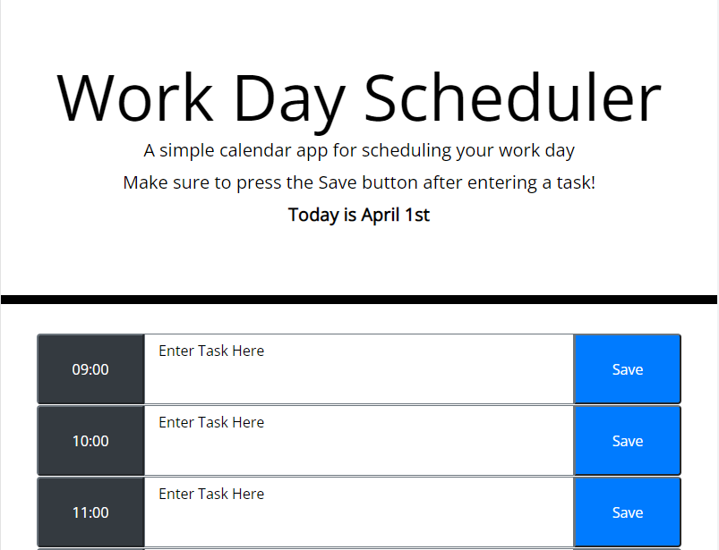

# Thomas Ciszek's Radical Work/Day Scheduler

## Description

- This website is made using HTML, CSS, and JavaScript
- It's main functionality is to be used to keep track of tasks that you would need to do throughout the work day
- This project was definitely not as hard as the last, that being the JavaScript Quiz, but it was not easy
- The main problem with this was not in figuring out how to make functions, but in truly understanding how to use third party APIs
- The API that gave me the most difficulty would probably be jQuery
- For whatever reason, I cannot understand their documentation, so for the majority of this project, I had to look at my previous code using jQuery

## The Website

The website is currently deployed at https://thomascsk.github.io/work-day-scheduler/

